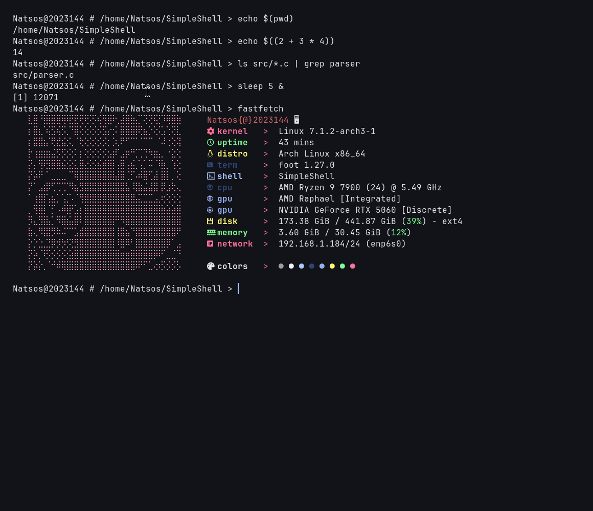

# SimpleShell

**SimpleShell** is a Unix shell written in C that implements many of the core features found in modern Unix shells. The project focuses on process management, parsing, shell expansions, and Unix system programming while maintaining a clean and modular architecture.

## Architecture

SimpleShell follows a modular architecture inspired by traditional language processors:

- **Lexer**: Converts raw command input into tokens while handling operators, quotes, and shell syntax.
- **Parser**: Builds an Abstract Syntax Tree (AST) representing command structure, pipelines, logical operators, and redirections.
- **Expansion Engine**: Performs variable expansion, wildcard expansion, command substitution, and arithmetic expansion.
- **Executor**: Traverses the AST and manages process creation, pipelines, redirections, and job control.

## Features
- Arithmetic Expressions
- Process Management
- Pipelines (|)
- Background execution (&)
- Job management
- Sequential execution (';')
- Logical operators (&& and ||)
- Input / Output Redirection
- Input redirection (<)
- Output redirection (>)
- Append redirection (>>)
- Shell Expansions
- Environment variable expansion ($VAR)
- Wildcard (glob) expansion (*, ?)
- Command substitution ($(...))
- Arithmetic expansion ($((...)))

## Additional Features
- Tab completion
- Automated regression test suite
- Modular codebase with separate lexer, parser, and executor components

## Building
make

## Running
./SimpleShell

## Contributions
Contributions are welcome!

If you'd like to contribute, feel free to open an issue or submit a pull request.

Please ensure that:

- New features include appropriate unit tests.
- All existing and new tests pass before submitting a pull request.
- The code follows the existing project style.
